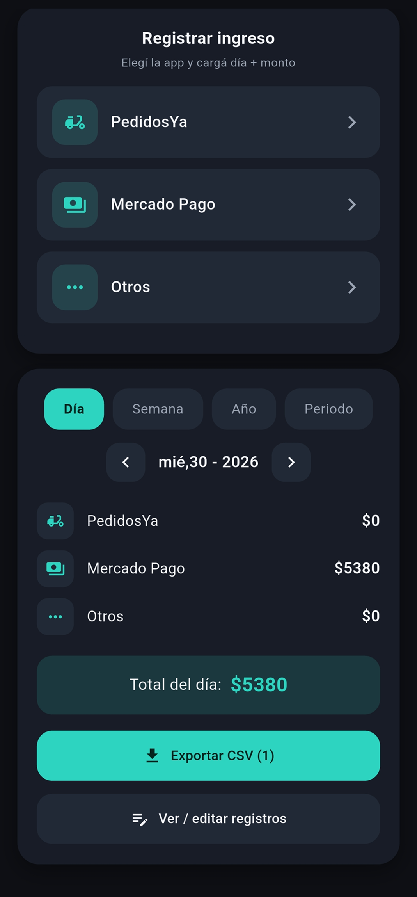

# Control de Ganancias — App de Ingresos para Riders

[](https://github.com/tincho950303/app-ingresos-riders/releases/latest)

> **Instalar en el celu:** toca el botón verde de arriba desde tu celular,
> descarga el APK y ábrelo (permite "instalar apps desconocidas").

App móvil **100% offline** para registrar y controlar ingresos por plataforma
(PedidosYa, Mercado Pago, Otros). Pensada para repartidores: anotás cada
ingreso con su día y monto, ves totales por día / semana / año / periodo,
editás o borrás registros y exportás todo a CSV.

## Características

- **Registro por app**: botones únicos para PedidosYa, Mercado Pago y Otros.
  Cada uno abre un formulario con selector de día y monto.
- **Resumen con filtros**: tabs Día, Semana (lunes a domingo), Año y Periodo
  personalizado, con navegador de fecha y total destacado.
- **CRUD completo**: pantalla de registros con filtro por app, edición y
  borrado con confirmación.
- **Exportar a CSV**: exporta el rango visible (`id,plataforma,monto,fecha`)
  y compártelo por WhatsApp, Drive o archivos.
- **Offline real**: base de datos local SQLite, sin cuentas ni internet.
  Funciona en modo avión.

## Capturas

<p align="center">
  
</p>

## Estilo

Diseño propio **"Nocturno Soft"**: oscuro moderno sin bordes, tarjetas
elevadas con sombra y acento menta. Las reglas visuales y tokens están en
[`AGENTS.md`](AGENTS.md) — fuente de verdad para cualquier cambio de UI.

## Instalación en el celular

1. Descarga el APK `app-release.apk` (carpeta
   `build/app/outputs/flutter-apk/` o el medio que te lo compartan).
2. Ábrelo en el celular y permite **"instalar apps desconocidas"**.
3. Listo: abre **Control de Ganancias** y úsala sin internet.

## Desarrollo

Requisitos: [Flutter](https://docs.flutter.dev/get-started/install) 3.x y
Android Studio.

```bash
flutter pub get
flutter analyze        # debe pasar limpio
flutter run            # con el celu por USB o emulador (hot reload con "r")
```

Vista rápida en PC (solo visual, con base IndexedDB del navegador):

```bash
flutter run -d edge
```

Build release para distribuir:

```bash
flutter build apk --release
# sale en build/app/outputs/flutter-apk/app-release.apk
```

## Estructura

```text
lib/
  main.dart      # UI + estado (pantallas, diálogo, resumen, export CSV)
  db_helper.dart # SQLite: tabla viajes(id, plataforma, monto, fecha)
AGENTS.md        # guía de estilo y arquitectura
```

## Stack

Flutter · sqflite · csv · path_provider · share_plus
